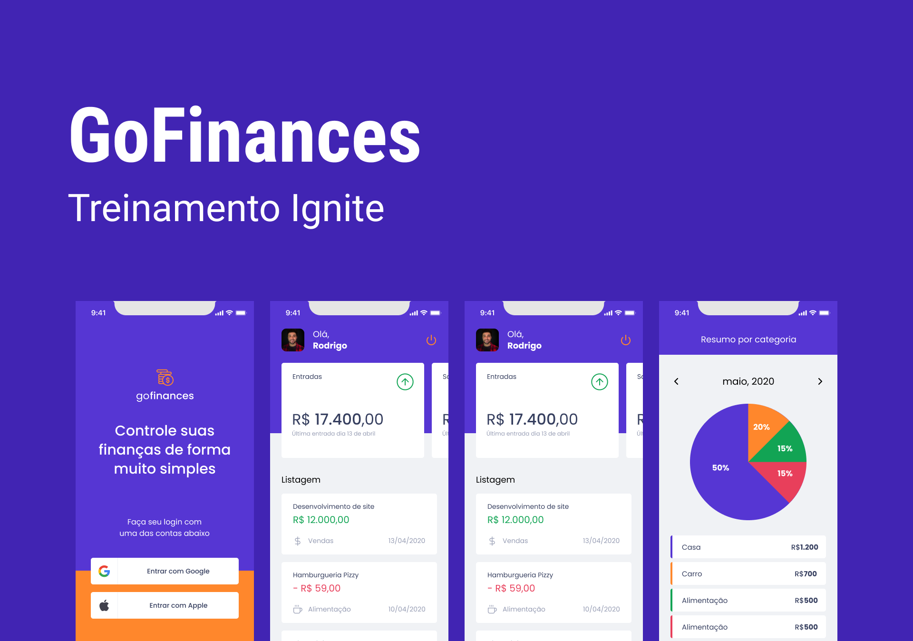

### GoFinance

Expo application developed in React Native using TypeScript

Google Credentials (https://console.cloud.google.com/)

`Configure your .env`

- [Expo Guide Authentication](https://docs.expo.dev/guides/authentication/#google)
- [Google Credentials](https://console.cloud.google.com/)

    CLIENT_ID=
    REDIRECT_URI=

Installed extra packages
- expo-font
- @expo-google-fonts/poppins
- expo-app-loading
- prettier
- styled-components
- react-native-responsive-fontsize
- react-native-iphone-x-helper
- [react-hook-form](https://react-hook-form.com/)
- [@react-navigation/native](https://reactnavigation.org/)
- [@react-navigation/bottom-tabs](https://reactnavigation.org/)
- [date-fns](https://date-fns.org/)
- [victory-native](https://formidable.com/open-source/victory/)
- intl
- @react-native-async-storage/async-storage
- react-native-uuid
- react-native-svg-transformer
- [expo-auth-session](https://docs.expo.dev/versions/latest/sdk/auth-session/)
- expo-random

In this application we intelligently and dynamically use styled-components
to customize the classes I style, focusing on code reuse. 

#### UI Avatars https://ui-avatars.com/

Used to replace the user's avatar image when there is no picture taken from the login profile.
